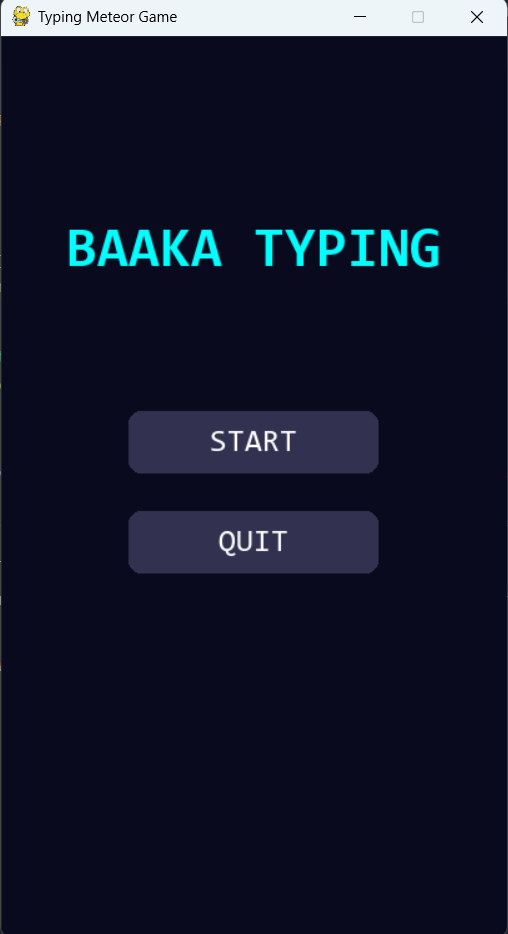

# 🚀 Typing Meteor Game

Game typing berbasis Python menggunakan Pygame, di mana pemain harus menghancurkan meteor dengan mengetik kata yang muncul.


## 📸 Preview

<p align="center">
  
  
  
</p>

## 🧠 Deskripsi

Typing Meteor Game adalah game edukatif berbasis typing di mana pemain harus mengetik kata yang muncul pada meteor untuk menghancurkannya sebelum mencapai dasar layar.

Game ini dibuat menggunakan library Pygame dengan pendekatan Object-Oriented Programming (OOP) dan sistem state-based scene management.

## ▶️ Cara Menjalankan

```bash
git clone https://github.com/Rahmatbaaka/PBO-8.git

cd PBO-8

pip install pygame

python main.py

